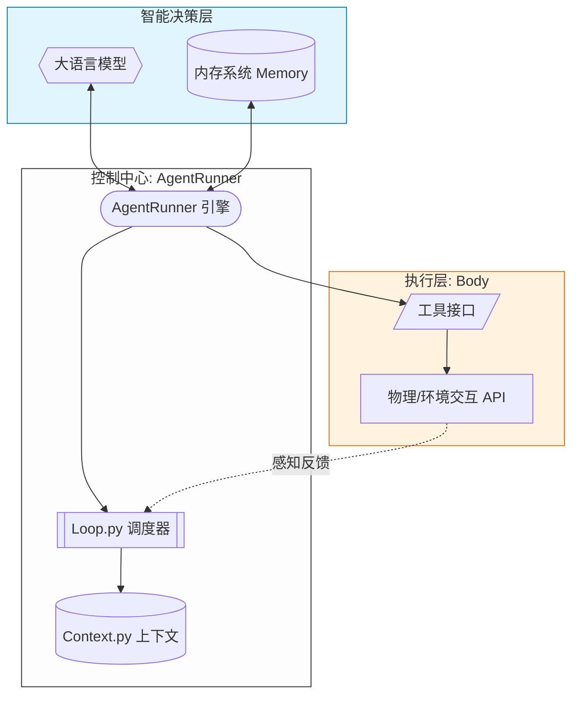
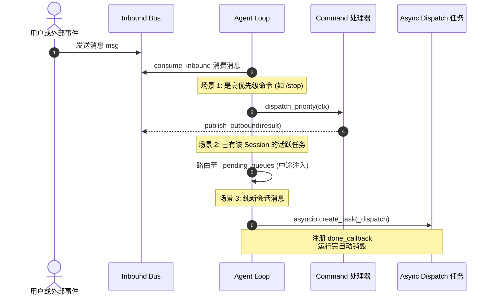

# Agent Loop

```mermaid
flowchart TD
    %% 核心控制层：使用子图 (Subgraphs)
    subgraph Control [控制中心: AgentRunner]
        direction TB
        Runner([AgentRunner 引擎]) 
        Loop[[Loop.py 调度器]]
        Context[(Context.py 上下文)]
        
        Runner --> Loop
        Loop --> Context
    end

    %% 智能决策层
    subgraph Intel [智能决策层]
        LLM{{大语言模型}} <--> Runner
        Memory[(内存系统 Memory)] <--> Runner
    end

    %% 执行与交互层
    subgraph Execution [执行层: Body]
        Tools[/工具接口/]
        Physics[物理/环境交互 API]
        
        Runner --> Tools
        Tools --> Physics
    end

    %% 反馈循环
    Physics -.->|感知反馈| Loop
    
    %% 定义样式
    style Control fill:#fdfdfd,stroke:#333
    style Intel fill:#e1f5fe,stroke:#0277bd
    style Execution fill:#fff3e0,stroke:#ef6c00
```

```mermaid
sequenceDiagram
    autonumber
    actor User as 用户或外部事件
    participant Bus as Inbound Bus
    participant AgentLoop as Agent Loop
    participant Cmd as Command 处理器
    participant Task as Async Dispatch 任务

    User->>Bus: 发送消息 msg
    AgentLoop->>Bus: consume_inbound 消费消息
    
    Note over AgentLoop: 场景 1: 是高优先级命令 (如 /stop)
    AgentLoop->>Cmd: dispatch_priority(ctx)
    Cmd-->>Bus: publish_outbound(result)
    
    Note over AgentLoop: 场景 2: 已有该 Session 的活跃任务
    AgentLoop->>AgentLoop: 路由至 _pending_queues (中途注入)
    
    Note over AgentLoop: 场景 3: 纯新会话消息
    AgentLoop->>Task: asyncio.create_task(_dispatch)
    Note over AgentLoop, Task: 注册 done_callback <br>运行完自动销毁
```
# Session
# Tools
## Built-in
## MCP Tool
# Context
# Skills
# Memory
# Channel
