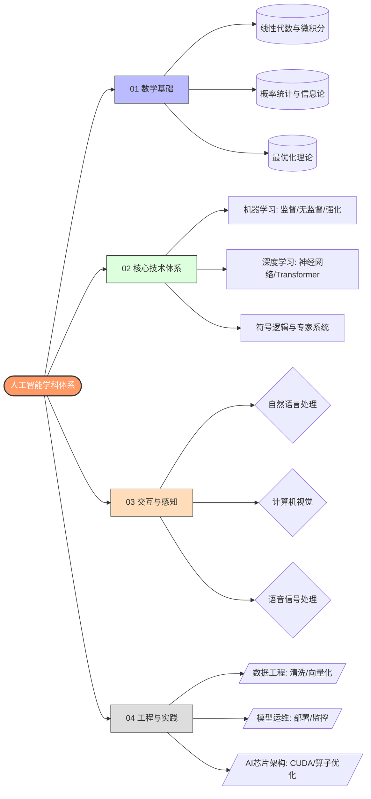

 

# 实验环境
- RTX 4060Ti 8G
- PyTorch
- Transformers
# PyTorch
## 核心概念

| 名字     | 功能  |
| ------ | --- |
| Tensor |     |
| Loss   |     |
|        |     |

# Transformers
## 核心概念

| 名字        | 功能  |
| --------- | --- |
| Attention |     |
|           |     |
# AI Agent

在人工智能领域，智能体被定义为任何能够通过**传感器（Sensors）**感知其所处**环境（Environment）**，并**自主**地通过**执行器（Actuators）**采取**行动（Action）**以达成特定目标的实体。

范式
- ReAct
- Plan-and-Solve
- Reflection

| 名字        | 功能  |
| --------- | --- |
| LangGraph |     |
| MCP       |     |
| RAG       |     |
| 训练        |     |
| Skills    |     |
| 记忆        |     |
| LangSmith |     |
| AgentOps  |     |

## 流程：
### Pretraining

> [!NOTE]
> 在学习之初缺乏先验知识，需要从零开始构建对任务的理解。无论是符号主义试图手动编码的常识，还是人类在决策时所依赖的背景知识，在RL智能体中都是缺失的。如何让智能体在开始学习具体任务前，就先具备对世界的广泛理解？这一问题的解决方案，最终在**自然语言处理（Natural Language Processing, NLP）**领域中浮现，其核心便是基于大规模数据的**预训练（Pre-training）**。

首先在一个包含互联网级别海量文本数据的通用语料库上，通过**自监督学习（Self-supervised Learning）**的方式训练一个超大规模的神经网络模型。这个阶段的目标不是完成任何特定任务，而是学习语言本身内在的规律、语法结构、事实知识以及上下文逻辑。最常见的目标是“预测下一个词”。
### Post-training

# LLM
语言模型（**Language Model**）是自然语言处理的核心，其根本任务是计算一个词序列出现的概率。
- N-gram模型
- 神经网络模型 （常用RNN、LSTM）
- Transformer
交互
- 提示
- 文本分词

这三个术语通常被统称为**模型训练阶段**，但在大语言模型（LLM）的生命周期中，它们代表了完全不同的目标和技术手段。

### 1. 训练 (Training / Pre-training)

这是从零开始构建模型的过程，通常被称为**预训练**。

- **输入**：海量的、未标记的原始文本数据（万亿级 tokens），如网页、书籍、代码等。
    
- **目标**：让模型学习人类语言的统计规律、基础常识和逻辑推理能力。
    
- **产出**：**基座模型 (Base Model)**。它能续写句子，但不会遵循指令（例如：你问它“谁是爱因斯坦？”，它可能会续写出一本传记的开头，而不是直接回答）。
    
- **成本**：极高。需要数千颗 GPU 运行数月。

### 2. 微调 (Fine-tuning)

这是你刚刚完成的操作。在现有的基座模型基础上，使用更小、更精选的数据集进行调整。

- **输入**：高质量的指令对数据（如你的 JSONL 文件，包含 `<human>` 和 `<bot>`）。
    
- **目标**：让模型学会特定的**任务格式**或**专业领域知识**。
    
- **产出**：**指令微调模型 (Instruct/Chat Model)**。它学会了如何听懂指令并以特定格式回答（如你看到的“高级软件工程师”语气）。
    
- **成本**：较低。通常几颗甚至一颗显卡（如你的 4060 Ti 或 5090）在几小时内即可完成。

### 3. 后训练 (Post-training)

这是一个更广泛的概念，包含了微调，但重点在于**对齐（Alignment）**。

- **包含内容**：
    
    - **SFT (监督微调)**：即上述的微调。
        
    - **RLHF (人类反馈强化学习)**：通过人类给多个回答打分，让模型学会哪些回答更受欢迎。
        
    - **DPO/PPO**：优化算法，减少模型产生幻觉或冒犯性言论。
        
- **目标**：解决安全、价值观对齐以及复杂逻辑推理问题（如 Qwen 3.5 的逻辑增强）。
    
- **产出**：最终可以推向市场的**正式版本模型**。

| **阶段**            | **核心数据** | **消耗资源** | **最终产物**    | **你的角色**            |
| ----------------- | -------- | -------- | ----------- | ------------------- |
| **Training**      | 万亿级原始数据  | 顶级算力集群   | 语言天才（但没规矩）  | 模型厂商（如阿里巴巴/OpenAI）  |
| **Fine-tuning**   | 万级特定指令对  | 单卡或几张卡   | 领域专家（按套路出牌） | **开发者（即现在的 Alisa）** |
| **Post-training** | 人类偏好评分   | 中等算力     | 完美的聊天助手     | 算法工程师/对齐团队          |
|                   |          |          |             |                     |
### 1. 预训练阶段 (Pre-training)

这是模型“出生”的过程，也是计算量最密集的阶段。

- **数据准备**：摄取数万亿 tokens 的原始数据（如 Common Crawl、GitHub 代码、科学论文）。
    
- **架构设计**：确定模型参数量（如 Qwen 3.5 的尺度）以及注意力机制等超参数。
    
- **大规模算力集群**：通常在成千上万颗 GPU 上运行数周或数月，利用分布式框架（如 Megatron-LM）进行同步训练。
    
- **产出**：**基座模型 (Base Model)**，具备强大的语言预测能力，但不懂得如何对话。
    

### 2. 后训练与对齐 (Post-training & Alignment)

这是你目前正在深度参与的阶段，赋予模型“灵魂”和“规矩”。

- **指令微调 (SFT)**：使用你准备的 JSONL 格式指令对进行训练，让模型学会遵循特定格式（如推理链）。
    
- **人类反馈强化学习 (RLHF)**：通过 PPO 或 DPO 算法，根据人类的偏好对模型输出进行打分和排序，使其回答更符合人类价值观。
    
- **产出**：**对话模型 (Chat/Instruct Model)**。
    

### 3. 模型压缩与量化 (Compression & Quantization)

为了让模型能在像你手中的 RTX 4060 Ti 或 5090 这样的硬件上高效运行，需要进行“瘦身”。

- **量化 (Quantization)**：将 FP32 或 BF16 精度压缩至 INT8、FP8 甚至更低，以显著降低显存占用。
    
- **蒸馏 (Distillation)**：用大模型指导小模型的学习，保留核心能力的同时减少参数量。
    

### 4. 部署与推理 (Deployment & Serving)

这是你最近使用 **vLLM** 成功跑通的阶段。

- **推理引擎加速**：利用 PagedAttention 等技术优化显存利用率（KV Cache 管理）。
    
- **图编译优化**：如你日志中看到的 `torch.compile`，通过内核级优化提升吞吐量。
    
- **API 集成**：通过 OpenAI 兼容接口，将能力输送给 Cherry Studio 或自定义 MCP 服务器等终端。
    

### 5. 评估与迭代 (Evaluation & RL Loop)

- **基准测试**：使用 MMLU、GSM8K 等数据集或像你刚才做的“卷纸题”变体来测试泛化能力。
    
- **持续学习**：根据用户反馈收集坏样本，重新进入 SFT 流程进行微调。

**Instruct 模型**

Instruct 模型在预训练时已内置指令，使其无需任何微调即可使用。这些模型（包括 GGUF 等常见格式）针对直接使用进行了优化，能够开箱即用地对提示做出有效响应。Instruct 模型可与 ChatML 或 ShareGPT 等会话聊天模板配合使用。

**Base 模型**

另一方面，Base 模型是未经过指令微调的原始预训练版本。它们专为通过微调进行自定义而设计，允许你将其调整为特定需求。Base 模型兼容像 [Alpaca 或 Vicuna](https://unsloth.ai/docs/zh/ji-chu-zhi-shi/chat-templates)这样的指令式模板，但通常开箱即用时不支持会话聊天模板。

**我应该选择 Instruct 还是 Base？**

决定通常取决于你的数据的数量、质量和类型：

- **1000+ 行数据**: 如果你有一个超过 1000 行的大型数据集，通常最好对 Base 模型进行微调。
    
- **300–1000 行高质量数据**: 对于中等规模的高质量数据集，对 Base 或 Instruct 模型进行微调都是可行的选择。
    
- **少于 300 行**: 对于较小的数据集，通常选择 Instruct 模型更为合适。对 Instruct 模型进行微调可以使其与特定需求对齐，同时保留其内置的指令能力。这可确保它在不需要额外输入的情况下遵循一般指令，除非你打算显著改变其功能。

## 垂直领域大模型
微调 / 训练 / 后训练模型可以定制其行为、增强并注入知识，以及针对特定领域和任务优化性能
标准的后训练方法成为**监督微调（SFT）**。其他方法包括偏好优化（DPO、ORPO）、蒸馏和**强化学习（GRPO、GSPO）**，其中一个智能体通过与环境交互并接收奖励或惩罚形式的反馈来学习决策
主要集中在后训练阶段
1. 准备微调前的指令数据集，让模型学会遵循特定格式
2. 人类反馈学习（RLHF）：通过PPO或者DPO算法，根据人类的偏好对模型输出进行打分和排序，使其回答更符合人类价值观
3. 可选，量化和蒸馏
4. 部署与推理
5. 评估与迭代

**训练的方法**

| 方法    | 功能                                             | 备注                                                       |
| ----- | ---------------------------------------------- | -------------------------------------------------------- |
| SFT   | **灌输知识与指令遵循**。通过“问题-答案”对，让模型学会特定领域的表达方式和知识点。   | **核心手段**。让模型学会什么是“夏普比率”，或者如何写一个 Python 策略脚本。             |
| RL    | **对齐偏好与逻辑推理**。通过奖励机制（Reward）引导模型在多个答案中选择更好的那一个 | **进阶手段**。比如给模型两个回测策略，让它学习哪个逻辑更稳健，或者通过 GRPO 强化模型的数学计算准确度。 |
| LoRA  | **参数高效微调**。不改动原始模型，只通过增加少量可训练参数来调整模型行为。        | **工程实现方案**。确保你不需要数张 H100 显卡就能完成训练，仅需微调 1% 左右的参数。         |
| QLoRA | **极限显存压缩**。在 LoRA 的基础上引入 4-bit 量化技术，大幅降低训练门槛。  | **低成本方案**。让你能在 16GB 显存的家用显卡上训练 Qwen3-7B，是目前个人开发者最常用的路径。  |
### 数据集
对于大型语言模型（LLM）来说，数据集是可用于训练我们模型的数据集合。为了对训练有用，文本数据需要以可以进行分词（tokenize）的格式存在。
创建数据集的关键部分之一是你的 [聊天 模板](https://unsloth.ai/docs/zh/ji-chu-zhi-shi/chat-templates) 以及你将如何设计它。分词也很重要，因为它将文本拆分为令牌（tokens），这些令牌可以是单词、子词或字符，以便大型语言模型能够有效处理。然后这些令牌被转换为嵌入（embeddings），并进行调整以帮助模型理解含义和上下文。
数据格式

| 格式                | 说明                                         | 训练类型       |
| ----------------- | ------------------------------------------ | ---------- |
| 原始语料              | 来自网站、书籍或文章等来源的原始文本。                        | 继续预训练（CPT） |
| 指令型               | 为模型提供要遵循的指令以及期望输出的示例。                      | 监督微调（SFT）  |
| 对话                | 用户与 AI 助手之间的多轮对话。                          | 监督微调（SFT）  |
| RLHF（基于人类反馈的强化学习） | 用户与 AI 助手之间的对话，其中助手的回复由脚本、另一个模型或人工评估者进行排序。 | 强化学习（RL）   |

**GRPO 如何训练模型**
1. 对于每个问答对，模型会生成多个可能的回复（例如 8 种变体）。
2. 每个回复都会使用奖励函数进行评估。
3. 训练步骤：
    - 如果你有 300 行数据，那就是 300 个训练步骤（如果训练 3 个 epoch，则是 900 步）。
    - 你可以增加每个问题生成的回复数量（例如从 8 个增加到 16 个）。
4. 模型会通过每一步更新其权重来学习。

# RAG (Retrieval-Augmented Generation)

# 记忆

# 协议
- MCP  （智能体访问外部服务）
- A2A  （多个智能体相互协作完成任务）
- ANP  （构建大规模的智能体生态系统）
