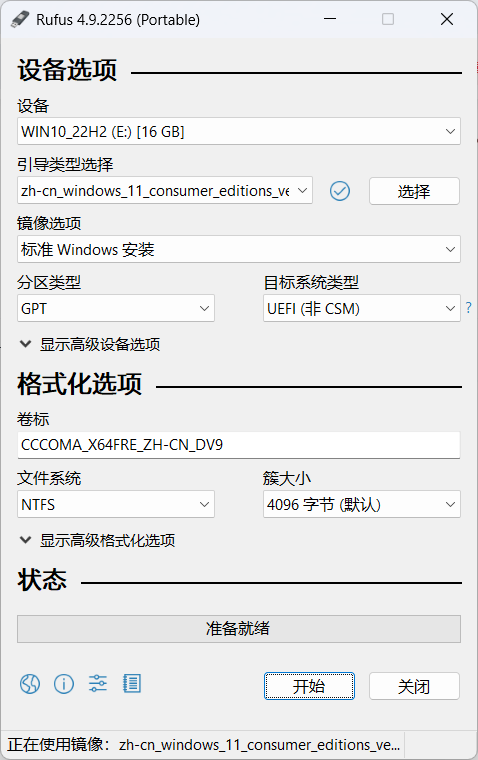
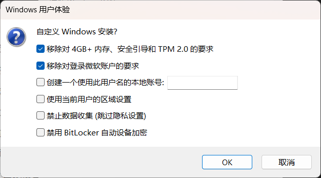

# Windows 11 系统安装

`windows 11` 强制要TPM 2.0以支持安全启动、内存隔离（如HVCI）等安全功能。支持的CPU通常有：

- **Intel**：第 8 代酷睿（Coffee Lake）或更新的 CPU，如 i3/i5/i7/i9-8000 系列及以上346
- **AMD**：Ryzen 2000 系列（Zen+）或更新的 CPU，如 Ryzen 3/5/7/9 2000 及以上（不包括部分 APU 如 2200G 和 2400G）

对于不支持的CPU若需要安装 `windows 11` 系统，可以在制作启动盘过程中绕过该检查。详细步骤如下。
## Step1 系统镜像下载

系统镜像下载渠道有很多，这里在 [xitongku](https://www.xitongku.com/index.html) 上查找需要的镜像。选择 `Windows 11` `24H2` `消费者版` 发布时间根据需要选择。点击 `下载` 后会跳转到下载方式页面，选择适合自己的方式下载镜像文件。例如下载2025年7月更新的：

> zh-cn_windows_11_consumer_editions_version_24h2_updated_july_2025_x64_dvd_a1f0681d.iso

## Step2 启动盘制作

准备容量**8G**以上（建议**16G及以上**）的U盘作为引导系统安装启动盘，使用 **rufus**（The Reliable USB Formatting Utility）工具烧录U盘，项目发布在GitHub上，[点击此处](https://github.com/pbatard/rufus/releases)下载。

打开 rufus.exe 界面如下

设备选择准备好的U盘，镜像文件选择下载的 windows 11 镜像文件，卷标就是U盘烧录后的名子，可以自定义。其他选项在不清楚含义的情况下建议按图中默认参数设置。之后点击 `开始` 会弹出选项窗口如下

重点勾选

> 移除对 4GB+ 内存、安全引导和 TPM 2.0 的要求

其他选项按需勾选。之后点击 `OK` 即可开始烧录，等待烧录完成，取出U盘即完成启动盘制作。

## Step3 安装系统

将需要安装系统的电脑关机，插入启动盘，按下开机键后，连续按下 `F12` 或 `delete` 键（不同电脑型号进入 BIOS 的按键不同，通常为这两个键）。选择启动项为用U盘UEFI引导，之后便进入 windows 11 安装步骤。其中需要注意两点：

1. 若需要输入产品密钥，可以选择 `我没有产品密钥` 来暂时跳过。
2. 在选择系统安装位置和磁盘分区步骤中，谨慎选择格式化的磁盘。若自己之间的文件需要留存，则仅选择原来系统盘格式化。同时一定不要把启动盘格式化（启动盘与机带磁盘的编号不同，例如原本机器上有一块硬盘，会有标记为 `磁盘0`，启动盘会标记为 `磁盘1`）

安装完成后，拔出启动盘，重启计算机，即可进入 windows 11 系统。

## Step4 驱动更新

以联想开天 N80z G1d ZHAOXIN KaiXian KX-U6780A@2.7GHz 系列计算机为例，重装系统后往往需要主动安装核显驱动和蓝牙网卡驱动。

### 核显驱动

前往兆芯官网下载对应CPU和操作系统的驱动，在此例中[点击此处](https://www.zhaoxin.com/qdxz.aspx?nid=31&typeid=555)下载。下载完成后解压，安装时，右击任务栏上的 `开始` 按钮，选择 `设备管理器`，找到 `显示适配器`，右击 `更新驱动程序`，选择 `浏览我的电脑以查找驱动程序`，选择位置为驱动解压的目录，即可完成安装。

### 蓝牙网卡驱动

搜索 `BT_AMD-MediaTek` 和 `WiFi_AMD-MediaTek` 下载，安装方法与上文核显驱动安装方法一致。（还有一个资源，但未验证，就是前往[百度贴吧](https://tieba.baidu.com/p/9082759745)二楼作者回复分享的[百度网盘链接](http://jump.bdimg.com/safecheck/index?url=rN3wPs8te/pjz8pBqGzzzz3wi8AXlR5g1NgdDpM6gxKJDvldXuqyJRM6XowltmJqaiA3XY9m8xJXGEwyoq+4Rai8QM32C0ucU9vjIFH/EszIfqLPJ8IXvcAiHmARy3ObJ2KlfUT6bNq43j0CVPhxVPmZxx/tJaPi7azz+g3ni/+ZYQJtP5582nY9qHh6BM0y)下载）